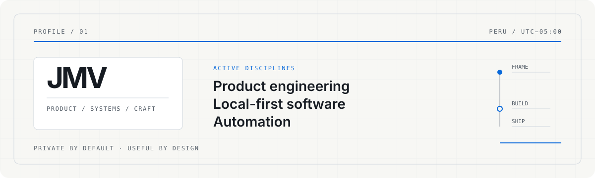
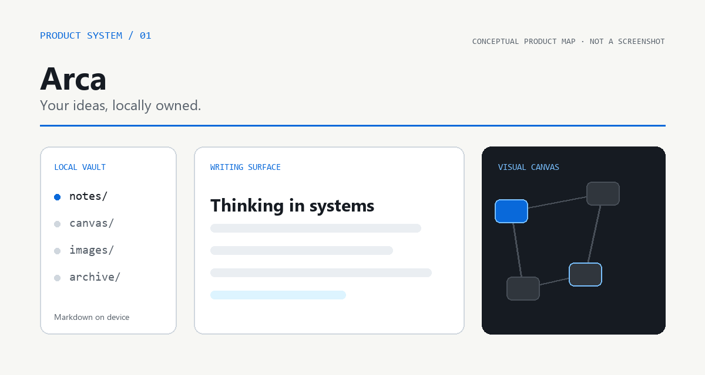
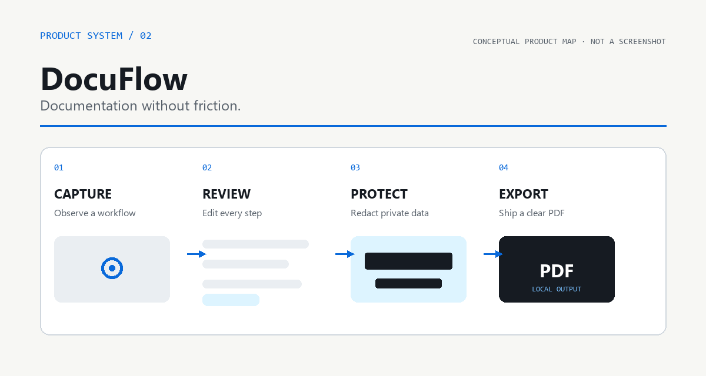
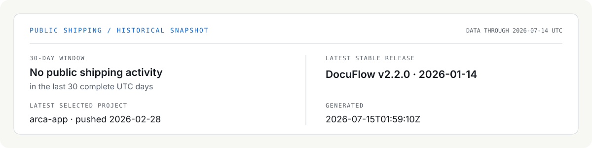

# Jose Maria Vallejos

**Product-focused Software Engineer** 
Building private, local-first tools.

`Based in Peru` · `Building for everywhere`

<picture>
  <source media="(prefers-reduced-motion: reduce)" srcset="assets/hero-static.svg">
  <source media="(prefers-color-scheme: dark)" srcset="assets/hero-dark.svg">
  <source media="(prefers-color-scheme: light)" srcset="assets/hero-light.svg">
  
</picture>

> **Current signal** — Building desktop tools that keep users in control.

I turn complex workflows into focused software: products that run locally,
respect ownership, and feel quiet enough to disappear into the work.

## Selected work

### Arca — Your ideas, locally owned

A local-first desktop workspace for notes, visual thinking, and creative work.
Arca keeps Markdown files on the user's machine while bringing together a
WYSIWYG editor, an infinite canvas, a whiteboard, rich media, and search.

`TypeScript` · `Electron` · `React` · `TipTap` · `tldraw`

[Explore the source →](https://github.com/Joserex10/arca-app)

---

### DocuFlow — Documentation without friction

A Windows automation tool that captures a workflow, turns interactions into
editable steps, protects sensitive areas, and exports a polished PDF — all on
the user's machine.

`Python` · `Windows UI Automation` · `CustomTkinter` · `PDF export`

[Explore the source →](https://github.com/Joserex10/DocuFlow) ·
[Latest stable release →](https://github.com/Joserex10/DocuFlow/releases/latest)

## Engineering principles

`01` **Privacy is a product feature.** 
`02` **Local-first means user ownership.** 
`03` **Useful software should feel effortless.**

## Public shipping snapshot

This is a generated historical snapshot, not a real-time activity feed.

<strong>Technical range</strong>

 

| Product engineering | Desktop & local-first | Automation & backend | Interface engineering |
|---|---|---|---|
| Product framing | Electron applications | Python workflows | React interfaces |
| Release thinking | Local file ownership | Windows UI Automation | Editing experiences |
| End-to-end delivery | Offline-first behavior | Document generation | Visual canvases |

## Let's build something useful

Have an ambitious product in mind? I am always interested in thoughtful
software, hard workflow problems, and tools that give people more control.

[LinkedIn](https://www.linkedin.com/in/jose-maria-vallejos-cabada-1b65952bb) ·
[GitHub](https://github.com/Joserex10)

Hecho desde Perú.

